# 02 - 区块链基础

在开始动手开发之前，我们首先需要了解区块链的本质，以及它能解决哪些问题。只有真正理解区块链的价值，你才能在开发中用它来解决真正适合的问题。

那我们现在就开始吧！

## 什么是区块链？

什么是区块链？它为什么重要？又能用来做什么？

简单来说，区块链是一种**分布式数据库**，但它具有一些非常特别的特点。

跟传统数据库不同，区块链**没有中央权威机构**，**任何人都可以使用**，而且**所有数据完全公开透明**。

在区块链上，任何人都可以自由支付，**没有任何单一机构**能够阻止或撤销这些支付。这种特性叫做**抗审查性（censorship resistant）**。

一旦交易被确认，就无法撤销，整个区块链就是一份所有交易记录的总账本，因此区块链常常被称作**分布式账本**。

传统数据库通常存储在某个中心服务器，而区块链上的数据则是**分布在全球成千上万台计算机上**。也就是说，没有哪一份单独的副本可以被篡改或丢失，因为大家手上都有备份，并且通过区块之间的相互验证来确保数据一致性。这种结构，我们称之为**去中心化（decentralization）**。

## 为什么区块链重要？

在实际应用中，这种机制意味着：区块链允许人们**直接交易，不再需要第三方中介**。

回想一下你上一次支付、换汇或者存钱的经历，你可能用了信用卡、汇款服务，或者直接通过银行，这其中总是需要通过中介机构。而且，每一笔交易通常都会有服务费，比如信用卡支付时卖家要付 2% 左右手续费，国际转账还要额外加收费用，就算只是存钱，银行也可能每月收取账户管理费。

而区块链允许用户直接交易，**无需中介、无额外费用**。

## 从比特币到 Solana

要理解区块链，我们必须从**比特币（Bitcoin）**讲起。2008 年，一个叫中本聪（Satoshi Nakamoto）的匿名人物发布了比特币白皮书，提出了一个不依赖任何银行或金融机构、能够直接进行**点对点数字支付**的系统。

区块链使用了**数字签名技术**，让人们在不需要完全互相信任的情况下也能进行交易。数字签名可以验证：支付的币种正确，支付的金额正确，而且交易确实已经发生。

比特币诞生至今已有超过 16 年，如今它更多被当作**数字黄金**而非日常支付工具。不过，在比特币之后，区块链技术也在不断演进。像 Solana 这样的现代区块链，不仅能支持**更快、更低手续费的支付**，而且通过**智能合约（Smart Contracts）**等新发明，赋予了区块链更多此前无法实现的新能力。

## 智能合约

智能合约其实就是运行在区块链上的计算机程序。不同于传统世界里托管在云服务器上的程序，智能合约直接运行在区块链网络上。

你可以把智能合约想象成传统互联网里的 API 接口，但有两个显著不同：

- 它们不是通过请求（Request）触发的，而是通过区块链上的**指令（Instruction）**来调用。
- 它们不会返回响应（Response），而是**直接把结果写入区块链**，让所有人都可以访问、验证。

通过智能合约，区块链不再局限于简单的转账，而是可以实现各种**复杂的交易逻辑**，例如：

- 贷款借贷，无需通过银行；
- 双方直接达成交换协议，无需第三方平台；
- 甚至可以创建一个去中心化的彩票系统，不需要任何中心化的彩票公司。
