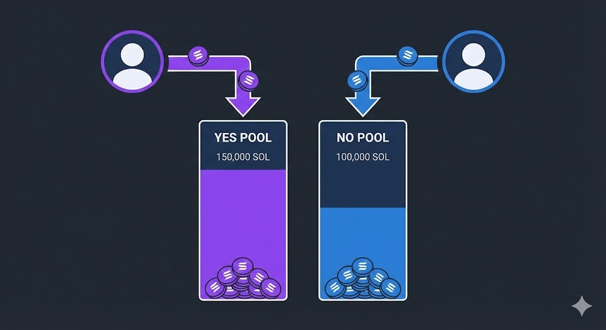
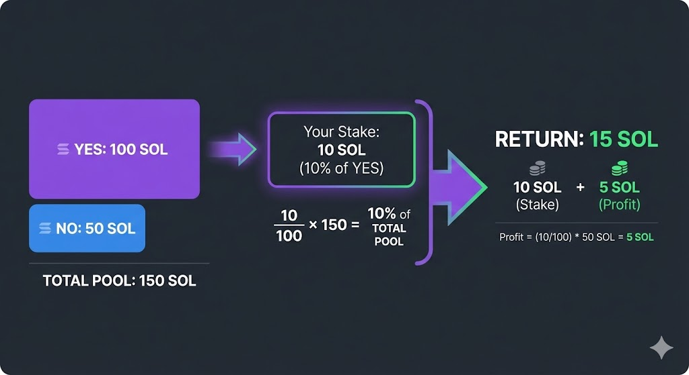
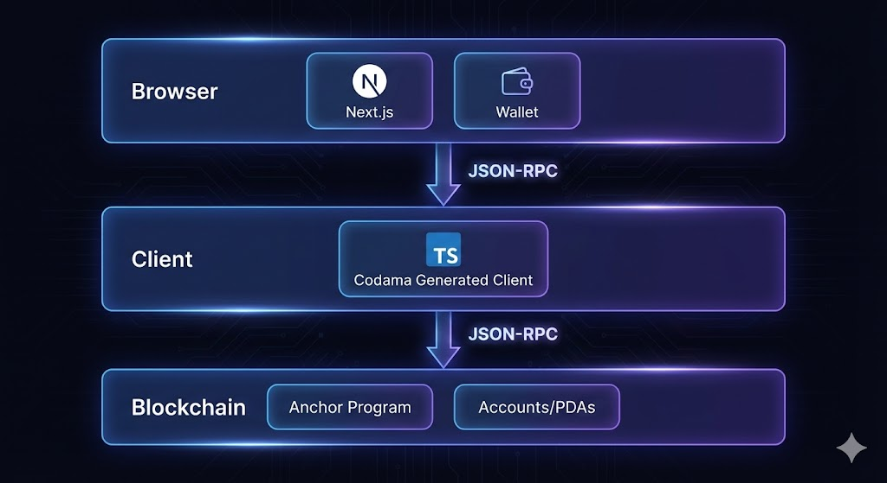
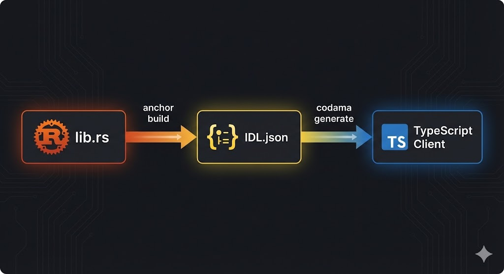
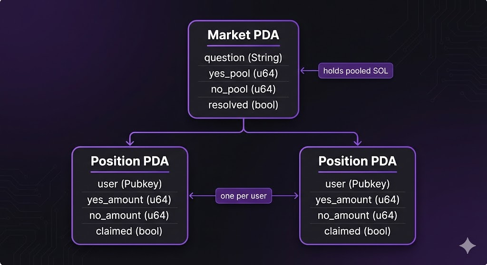
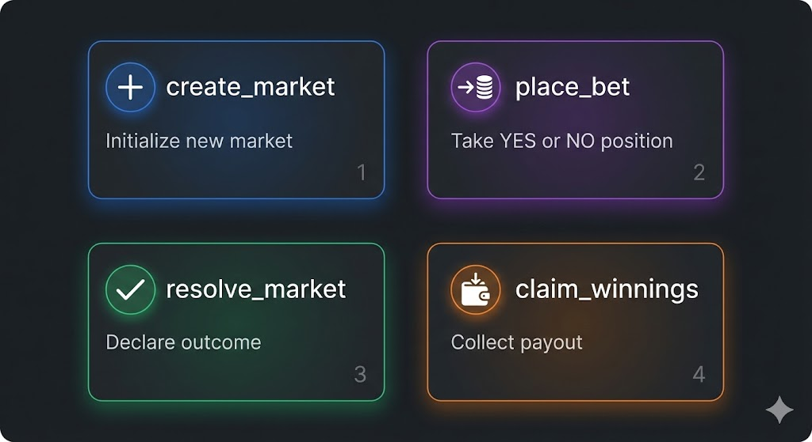

# 第一部分：为什么 & 是什么

**时长:** 15 分钟

---

## 1.1 — 问题背景 (5 分钟 | ~750 字)

<!-- 纯讲解 - 解释预测市场，为什么需要区块链 -->

自 2024 年底以来，预测市场已进入主流讨论。最著名的包括 Kalshi 和 Polymarket。

> **[图表: Polymarket 和 Kalshi 首页截图]**

预测市场平台特别适合 Solana 网络的优势，因为它们从低费用和快速交易速度中受益匪浅。如果您下注 5 美元，您真的无法承受 1 美元的交易费。Solana 使小额下注变得可行，让每个人都能参与。

当它们正确预测了 2024 年美国总统选举结果时，它们尤其受欢迎。这次选举被专业民意调查机构严重误判，而预测市场却正确预测了结果。

> **[图表: Polymarket 2024 年选举图表与民意调查预测对比]**

为什么市场能预测正确？这归结为利益相关。与免费表达意见的民意调查不同，预测市场要求您用金钱支持您的信念。如果您信息错误，您会亏钱。如果您信息正确，您会获利。随着时间的推移，价格会向真相靠拢。人们有时称此为"有责任感的群体智慧"。

这些产品的核心提供了一个非常简单的前提：您会看到关于结果的问题。大多数问题都是二元结果形式，一个问题的答案是另一个的相反。让我们看几个例子。

"比特币价格在 2026 年收盘时将超过 150,000 美元 — 是或否？"

> **[图表: 带有比特币问题的简单是/否卡片 UI 模拟图]**

您选择一方，下注您的资金，然后等待。

我们可以通过提出不同的区间来创建更有趣的合约：

"比特币价格将超过 150,000 美元但低于 200,000 美元"
"比特币价格将超过 200,000 美元"

通过组合这些不同的二元真假问题，我们能够找到最接近的结果并完善我们的预测。请注意，一些预测市场有能力使用超过两个结果的问题，但今天我们将专注于在这些二元问题限制下进行设计。这使 Solana 程序逻辑保持简单，同时仍能提供良好的用户体验。

那么这些市场实际上如何运作？机制很简单。当您持仓时，您的资金会进入一个资金池。有一个"是"池和一个"否"池。当结果确定时，获胜者按比例分配失败者的资金池。



假设有一个市场，"是"池有 100 SOL，"否"池有 50 SOL。您在"是"上下注 10 SOL。这意味着您拥有"是"池的 10%。如果"是"获胜，您将拿回 10 SOL 加上"否"池的 10% — 即 5 SOL 利润。如果"否"获胜，您将损失 10 SOL，这些资金将分配给"否"方。



这创建了一个自然的价格发现机制。如果大多数人认为"是"会获胜，更多资金会流入"是"池。但这也意味着"是"的奖金会变小。在某些时候，逆向投资者会看到选择另一方的价值。资金池之间的比率反映了人群的集体概率估计。

这就是我们今天要构建的内容。

> **[图表: 完成应用的预览 — 带有活跃市场的市场列表]**

在本讲座结束时，您将了解如何从零开始在 Solana 上创建预测市场。我们将涵盖全栈，从运行在链上的 Rust 程序到用户交互的 React 前端。

在 Solana 方面，我们将编写四个指令：创建市场、持仓、结算市场和领取奖金。我们将讨论账户设计和约束条件。我们将查看防止人们在截止时间后持仓或重复领取的验证逻辑。

在前端方面，我们将了解如何从链上获取所有市场，解码账户数据，并在 React 组件中显示。我们将使用一个名为 Codama 的代码生成工具，它读取我们的 Rust 程序并自动生成 TypeScript 客户端代码。这意味着我们无需手动编写序列化逻辑就能获得类型安全的指令构建器。

这个架构起初可能看起来很多，但它可以分解为清晰的层次。让我们从大局开始。

---

## 1.2 — 架构概述 (10 分钟 | ~550 字)

<!-- 重点在图表 - 让视觉效果呼吸 -->

让我们概述一下架构。这是一个全栈讲座，所以虽然我们会讨论程序，但我们将更专注于应用程序、签名者和交易之间的完整集成。



我们应用程序的前端将使用 Next.js。我们完全可以使用其他 React 框架甚至其他 JavaScript 框架，但 Next.js 提供了一种简单的方式来获得良好的生产标准，如服务器端渲染能力和许多我们不想花时间手动设置的优化。

> **[图表: Next.js 徽标 + 简要功能亮点]**

前端将分为两个页面。第一个页面将显示所有当前活跃的市场 — 比如我们比特币超过 150,000 美元的示例 — 带有允许用户持仓的组件。

> **[图表: 带有市场卡片的市场列表页面截图]**

第二个页面将是一个盈亏页面，显示过去市场的统计数据。我们将使用此页面作为示例，展示如何显示数据并为用户呈现良好的界面。

> **[图表: 带有统计数据的活动/盈亏页面截图]**

这些组件将使用 Solana SDK 套件中的两个易于使用的库与区块链通信。这些将是 `@solana/client` 和 `@solana/react-hooks`。这些将为我们处理钱包连接和与 RPC 层的通信。

> **[图表: 显示钱包连接设置的代码片段]**

当需要连接到我们的程序并提交指令或从账户读取时，我们将使用从 Codama IDL 库生成的 TypeScript 客户端。

这部分非常有用，因为它将为我们提供一个完全类型化的客户端，能够序列化指令并快速与我们的程序通信。我们将探索如何生成此客户端并通过前端 Solana 库使用它。整体架构和通信将是 UI 到程序的直接通信，无需索引或其他更高级的技术。



交易将被发送到 devnet 上的 RPC，我们的 Anchor 程序将负责对不同账户和 PDA 进行操作。

我想讨论的一个注意事项是，这不是一个生产就绪的预测市场。通常建议使用预言机来结算市场，因为它会在过程中建立信任。在我们的实现中，市场创建者结算结果。



如您所见，我们在这个实现中保持了账户设计相当简单。每个市场将是一个 PDA，以便我们可以在链上轻松重建它们，每个持有用户持仓的头寸也将是一个 PDA。

我们的整个设计将包含简单的 4 个指令：

1. **create_market** — 用问题初始化新市场
2. **place_bet** — 在是或否上持仓
3. **resolve_market** — 创建者声明结果
4. **claim_winnings** — 获胜者提取奖金



Solana 程序的优点在于，这四个简单指令可以组合成一个功能完整的预测市场。

此时，您应该有一个清晰的心理模型：一个市场是两个资金池、一个市场账户，以及一些按照严格规则移动 lamports 的指令。没有什么神奇的，只是受约束的状态转换。这就是为什么 Solana 非常适合：它使这些微小、频繁的下注变得便宜和快速，同时保持一切透明。

在下一部分中，我们将亲自动手处理链上程序。我们将定义账户数据，推导 PDA，并编写带有护栏的指令处理程序，防止延迟下注或重复领取。我们还将讨论我们正在做出的权衡（如创建者结算结果）以及您在生产系统中如何升级此功能。

一旦程序稳固，我们将回到堆栈上层，并使用生成的客户端连接 UI。让我们开始构建。

# 第二部分：链上程序

**时长:** 30 分钟

---

## 2.1 — 账户结构 (10 分钟 | ~900 字)

<!-- 屏幕共享代码 - 讲解 state.rs -->

好的，在编写任何代码之前，我们需要决定链上存储什么。在 Solana 上，程序基本上是对账户的纯函数：每个指令接收账户，读取它们，然后将它们写回。所以账户布局是真正的 API。把这个弄对了，其他一切都变成简单的状态转换。

对于这个构建，我们保持最小化。两个账户：`Market` 用于全局状态，`UserPosition` 用于单个用户的持仓。没有订单簿，没有价格历史，没有链下引用。只是我们验证下注和支付所需的数据。这就是整个想法。

我们在 `state.rs` 中使用 `#[account]` 和 `#[derive(InitSpace)]` 定义这些。快速说明：`InitSpace` 很重要，因为 Solana 要求您预先分配空间。太小会导致交易失败，太大则会永远消耗 lamports。使用 `InitSpace` 和 `#[max_len]`，Anchor 会为我们计算大小，所以我们不需要手动计算。

**讲解: `anchor/programs/prediction_market/src/state.rs`**

```rust
pub struct Market {
    pub creator: Pubkey,        // 32 字节 - 谁可以结算
    pub market_id: u64,         // 8 字节 - 唯一 ID
    pub question: String,       // 可变 - "X 会发生吗？"
    pub resolution_time: i64,   // 8 字节 - 下注截止时间
    pub yes_pool: u64,          // 8 字节 - 总 YES lamports
    pub no_pool: u64,           // 8 字节 - 总 NO lamports
    pub resolved: bool,         // 1 字节 - 结果是否已设置？
    pub outcome: Option<bool>,  // 2 字节 - None, Some(true), Some(false)
    pub bump: u8,               // 1 字节 - PDA bump seed
}
```

让我们快速过一遍，我会保持简洁。`creator` 是可以结算市场的权限。可以把它看作是管理员。我们存储它以便后续指令可以检查签名者。它也进入 PDA seeds，所以一个创建者可以运行多个市场而不会冲突。

`market_id` 是我们传入的 u64。它只在每个创建者内唯一，就像每个创建者的序列号。PDA seed 使用 `b"market" + creator + market_id`，所以两个创建者都可以有 market_id 1 并获得不同的地址。很酷的部分是确定性发现：给定创建者和 id，客户端可以在没有任何注册表的情况下推导出市场地址。

`question` 是问题提示。我们使用 `MAX_QUESTION_LEN` 将其限制在 200 个字符，使账户保持小而可预测。Anchor 中的 `String` 包括 4 字节长度前缀加上字节，所以最大长度对租金很重要。它也保持 UI 整洁。

`resolution_time` 是 i64 Unix 时间戳。我们用它来拒绝过去创建的市场，并在截止时间后关闭下注。在 Solana 上，`Clock::get()?.unix_timestamp` 是时间来源。它不是完全精确的，但对于教程来说没问题。

`yes_pool` 和 `no_pool` 只是每边 lamports 的运行总计。当用户下注时，我们将 lamports 移动到市场 PDA 并增加其中一个池。这里没有定价曲线；隐含概率只是两个池的比率。简单的同注分彩数学，没什么花哨的。

`resolved` 和 `outcome` 一起工作。`resolved` 是一个快速防护，防止重复结算。`outcome` 是一个 `Option<bool>`，所以我们可以表示三种状态：`None`（未结算）、`Some(true)`（YES 获胜）和 `Some(false)`（NO 获胜）。这避免了"未结算"与"NO"的混淆。

`bump` 存储 PDA bump seed。我们在账户创建时计算它并存储在链上，以便后续指令可以在客户端不传递的情况下重新推导 PDA。您将在 `claim_winnings` 的账户约束中看到这一点，其中 PDA 通过 seeds 和 bump 进行验证。

接下来是 `UserPosition`。这个账户按市场按用户创建，并随时间聚合他们的下注。我们不是为每次下注创建新账户，而是保留一个账户并更新其总计。这使账户管理和 UI 逻辑保持简单。

```rust
pub struct UserPosition {
    pub market: Pubkey,      // 此持仓属于哪个市场
    pub user: Pubkey,        // 持仓的所有者
    pub yes_amount: u64,     // 在 YES 上下注的 lamports
    pub no_amount: u64,      // 在 NO 上下注的 lamports
    pub claimed: bool,       // 奖金是否已领取？
    pub bump: u8,            // PDA bump seed
}
```

所以 `market` 和 `user` 只是将此持仓绑定到特定市场和所有者。存储两者使账户自描述，并允许我们稍后添加约束，如 `user_position.user == user.key()`。

`yes_amount` 和 `no_amount` 是累积总计。我们有意允许两者都非零，这意味着用户可以通过在双方下注来对冲或改变主意。我们这里不进行任何净额结算；当我们支付时，只有获胜方计入。

`claimed` 是一个单向标志。一旦用户提取了他们的奖金，我们将其设置为 true 并拒绝任何进一步的领取。它防止了即使有人重新提交相同交易的双重支付。`bump` 扮演与 `Market` 账户中相同的角色：它让我们确定性地重新推导 PDA。

关于空间的快速说明：对于 `Market`，大小是固定字段加上 4 字节字符串长度前缀和 200 字节最大问题。对于 `UserPosition`，它主要是固定的：两个 pubkey，两个 u64 总计，一个 bool 和一个 bump。Anchor 的 `INIT_SPACE` 保持这个准确，所以我们可以分配 `8 + Market::INIT_SPACE` 和 `8 + UserPosition::INIT_SPACE` 而无需手动计算。

最终结果：一个小的、稳定的账户模型。它也很容易扩展：您可以添加 `fee_bps` 字段、`oracle` pubkey 或 `category` 枚举，而无需触及核心流程。对于教程来说，这两个账户就足够了。现在我们可以继续讨论修改它们的指令逻辑。

**讨论要点:**
- 为什么每个字段存在
- `Option<bool>` 如何表示三种状态（未结算、是、否）
- 为什么我们为每个用户的每个市场保留一个 `UserPosition`
- PDA seeds 如何提供确定性地址
- 租金豁免的空间计算

---

## 2.2a — 函数: create_market (5 分钟 | ~400 字)

<!-- 代码讲解 - 突出验证模式 -->

好的，`create_market` 是一切开始的地方。可以把它看作是设置步骤。它分配市场 PDA，存储元数据，并将资金池清零。在 Anchor 中，大部分设置位于账户结构中，而不是指令体中。

快速查看一下 `lib.rs` 中的 `CreateMarket` 账户：我们使用 `init`、`payer = creator`、`space = 8 + Market::INIT_SPACE`，以及 seeds `b"market"`、创建者公钥和 `market_id` 字节。这为我们提供了一个确定性地址。相同的创建者 + id 意味着每次都是相同的 PDA。尝试创建两次，第二次交易将失败，因为账户已存在。

输入很简单：`market_id`、问题字符串和结算时间。我们在接触状态之前验证两者。问题长度检查强制执行 `MAX_QUESTION_LEN`，使账户适合我们分配的空间。时间检查确保市场在未来；否则您将创建一个已经关闭的市场。

**讲解: `anchor/programs/prediction_market/src/lib.rs`**

```rust
pub fn create_market(
    ctx: Context<CreateMarket>,
    market_id: u64,
    question: String,
    resolution_time: i64,
) -> Result<()> {
    require!(question.len() <= MAX_QUESTION_LEN, MarketError::Overflow);

    let clock = Clock::get()?;
    require!(
        resolution_time > clock.unix_timestamp,
        MarketError::ResolutionTimeInPast
    );

    let market = &mut ctx.accounts.market;
    market.creator = ctx.accounts.creator.key();
    market.market_id = market_id;
    market.question = question;
    market.resolution_time = resolution_time;
    market.yes_pool = 0;
    market.no_pool = 0;
    market.resolved = false;
    market.outcome = None;
    market.bump = ctx.bumps.market;

    Ok(())
}
```

验证之后，我们明确填充每个字段。没有意外。这使账户可预测，并避免依赖默认值。我们还存储来自 `ctx.bumps.market` 的 bump，以便后续指令可以在客户端不每次提供 bump 的情况下验证 PDA。

顺便说一下，即使 `market_id` 已经是 PDA seeds 的一部分，我们仍然将其存储在账户上。这对 UI 很方便，并让我们稍后在 `claim_winnings` 中重新推导 PDA，而无需用户传递它。我们还将 `resolution_time` 存储为 i64，因为时钟系统变量使用 i64，所以我们避免转换。在生产环境中，您可能会在这里添加更多验证 — 最小持续时间、问题内容的健全性检查，或防止垃圾邮件的小额创建费。对于教程来说，两个防护就足够了。

一个快速的设计选择：我们不存储市场的全局列表。在 Solana 上，枚举所有账户是 RPC 或索引器的问题，而不是程序的责任。保持程序专注使其运行更便宜且更容易审计。客户端可以通过扫描 PDA 或如果需要搜索体验则通过链下索引来发现市场。

**关键点:** 验证发生在状态更改之前

---

## 2.2b — 函数: place_bet (7 分钟 | ~500 字)

<!-- 代码 + 资金流图 - 慢节奏 -->

好的，`place_bet` 是热路径。每个是/否点击都会命中它，所以我们保持它精简。可以将其视为三个步骤：验证、将 lamports 移动到市场 PDA，并更新市场和用户持仓的会计。

第一个防护：`amount > 0`。听起来很简单，但它防止了仍然可以创建持仓账户并浪费租金的空操作交易。下一个防护检查截止时间：如果 `Clock::get()?.unix_timestamp` 大于或等于 `resolution_time`，下注已关闭。我们在任何转移之前执行此操作，因此我们永远不会在截止时间后移动资金。

然后我们进行转移。没什么花哨的：我们使用系统程序将原生 lamports 从用户移动到市场 PDA。用户签署交易，市场账户只是接收资金。因为 PDA 是程序拥有的，它不需要签名来接收 lamports。如果您想用像 USDC 这样的 SPL 代币下注，这就是您将 CPI 到代币程序的地方。

**图表: 资金流**

```
   用户钱包                    市场 PDA
       │                              │
       │    转移(金额)                 │
       ├─────────────────────────────►│
       │                              │
       ▼                              ▼
  余额 -= 金额              yes_pool += 金额
                                  (或 no_pool)
```

**讲解: `anchor/programs/prediction_market/src/lib.rs`**

```rust
pub fn place_bet(
    ctx: Context<PlaceBet>,
    amount: u64,
    bet_yes: bool,
) -> Result<()> {
    require!(amount > 0, MarketError::InvalidBetAmount);

    let clock = Clock::get()?;
    let market = &ctx.accounts.market;
    require!(
        clock.unix_timestamp < market.resolution_time,
        MarketError::BettingClosed
    );

    transfer(
        CpiContext::new(
            ctx.accounts.system_program.to_account_info(),
            Transfer {
                from: ctx.accounts.user.to_account_info(),
                to: ctx.accounts.market.to_account_info(),
            },
        ),
        amount,
    )?;

    // 更新资金池
    let market = &mut ctx.accounts.market;
    if bet_yes {
        market.yes_pool = market.yes_pool.checked_add(amount)
            .ok_or(MarketError::Overflow)?;
    } else {
        market.no_pool = market.no_pool.checked_add(amount)
            .ok_or(MarketError::Overflow)?;
    }

    // 更新用户的持仓...
}
```

只有在转移成功后，我们才更新资金池总计。我们在 u64 上使用 `checked_add` 来防止溢出。溢出在正常使用中很少见，但它是一个常见的攻击面：如果有人可以将资金池包装为零，他们可以扭曲隐含价格或窃取资金。防御性数学保持会计合理。

接下来我们更新用户的持仓。`user_position` 账户使用 `init_if_needed` 创建，这意味着第一次下注支付租金，后续下注重用同一账户。在第一次下注时，我们设置 `market` 和 `user`，并存储 bump，以便稍后验证 PDA。在每次下注时，我们增加 `yes_amount` 或 `no_amount`。

是的，用户可以随时间在双方下注。这是有意的。一些交易者想要对冲，或者想在不关闭账户的情况下改变主意。我们不净额结算这些持仓。当市场结算时，只有获胜方计入。失败方保留在资金池中，并分配给获胜者。

这是一个简单的同注分彩模型，不是 AMM。没有曲线，没有滑点，没有价格保护。"价格"只是任何给定时刻的资金池比率。这使得逻辑易于推理，非常适合教程。一旦您理解了这个流程，如果您愿意，可以换入更高级的定价。

我们也不存储明确的价格；UI 从资金池比率动态推导它。这使链上状态保持最小，并避免额外的舍入逻辑。

**关键洞察:** `checked_add` 在溢出时返回 `None` 而不是包装。这防止了有人可能溢出资金池为零的攻击。

---

## 2.2c — 函数: claim_winnings (8 分钟 | ~550 字)

<!-- 奖金图 + 代码 - 让数学深入人心 -->

好的，`claim_winnings` 是结算步骤。它是唯一将 lamports 移出市场 PDA 的指令，所以我们放慢速度并在这里仔细检查一切。流程是：验证市场已结算，验证用户尚未领取，计算用户的份额，转移 lamports，并将领取标记为完成。

在此之前，必须有人调用 `resolve_market` 来设置结果。在本教程中，只有市场创建者可以这样做，并且他们只能在结算时间之后进行。这是我们为使程序简单而做出的信任假设。在生产环境中，您通常会将其替换为预言机或多签，以避免单点故障。

**图表: 奖金计算**

```
示例市场:
┌─────────────────────────────────────┐
│  YES 池: 100 SOL                    │
│  NO 池:   50 SOL                    │
│  结果: YES 获胜                     │
└─────────────────────────────────────┘

用户在 YES 上下注 10 SOL:
┌─────────────────────────────────────┐
│  获胜者份额: 10/100 = 10%           │
│  从失败者池领取: 50 × 10% = 5       │
│  总支付: 10 + 5 = 15 SOL            │
└─────────────────────────────────────┘
```

**讲解: `anchor/programs/prediction_market/src/lib.rs`**

```rust
pub fn claim_winnings(ctx: Context<ClaimWinnings>) -> Result<()> {
    let market = &ctx.accounts.market;
    let position = &ctx.accounts.user_position;

    // 防护
    require!(market.resolved, MarketError::NotResolved);
    require!(!position.claimed, MarketError::AlreadyClaimed);

    // 确定获胜方
    let outcome = market.outcome.unwrap();
    let (user_winning_bet, total_winning_pool, total_losing_pool) = if outcome {
        (position.yes_amount, market.yes_pool, market.no_pool)
    } else {
        (position.no_amount, market.no_pool, market.yes_pool)
    };

    require!(user_winning_bet > 0, MarketError::NoWinnings);

    // 计算奖金
    let winnings = (user_winning_bet as u128)
        .checked_mul(total_losing_pool as u128)
        .ok_or(MarketError::Overflow)?
        .checked_div(total_winning_pool as u128)
        .ok_or(MarketError::Overflow)? as u64;
    let total_payout = user_winning_bet
        .checked_add(winnings)
        .ok_or(MarketError::Overflow)?;

    // 从 PDA 转移到用户
    let market_account_info = ctx.accounts.market.to_account_info();
    let user_account_info = ctx.accounts.user.to_account_info();

    **market_account_info.try_borrow_mut_lamports()? -= total_payout;
    **user_account_info.try_borrow_mut_lamports()? += total_payout;

    let position = &mut ctx.accounts.user_position;
    position.claimed = true;

    Ok(())
}
```

相当直接：第一个防护是 `market.resolved` 和 `!position.claimed`。简单的检查，但很重要。没有它们，用户可以在结算前领取或多次领取。我们还通过检查 `user_winning_bet > 0` 来验证用户有获胜的下注。如果您只在失败方下注，就没有什么可领取的。

我们通过读取 `market.outcome` 来确定获胜方。因为市场已结算，这个选项应该是 `Some(true)` 或 `Some(false)`。然后我们选择用户的获胜金额以及总获胜和失败资金池。这就是我们支付所需的一切；我们不存储任何每注历史。

奖金公式是同注分彩：`奖金 = (用户下注 / 获胜池) * 失败池`。在实际代码中，我们使用 u128 数学来避免大数相乘时的溢出。整数除法向下取整结果，因此市场 PDA 中可能留下一些 lamports。这在整数算术中是正常的，并使程序具有确定性。

要转移 lamports，我们不能调用系统程序。市场 PDA 是程序拥有的，系统程序只从签名者账户移动 lamports。相反，我们直接改变市场和用户账户上的 lamports 字段。这是安全的，因为程序拥有市场账户，并且我们已经在账户约束中验证了用户和 seeds。

我们还依赖这些账户约束来确保 `user_position` PDA 与签名者匹配。

转移后，我们将 `position.claimed` 翻转为 true。这使得领取是幂等的：如果用户再次提交交易，它将在防护处失败。在这个版本中，我们不关闭持仓账户，但我们可以添加一个 `close = user` 约束，以便在领取后回收租金。

最后一个值得指出的细微差别：如果用户在双方都下注，只有获胜方获得支付。失败方保留在资金池中并分配给获胜者，如果他们也有获胜的下注，这包括他们自己。这即使在用户对冲时也保持数学一致性。总体总计仍然平衡，因为进入市场的所有 lamports 要么被支付，要么作为零头保留。

这就完成了链上流程。我们现在有了一个完整的循环：创建市场、下注、结算市场和领取奖金。接下来，我们将采用这个程序接口并生成一个 TypeScript 客户端，以便前端可以类型安全地调用这些指令。

# 第三部分：代码生成层

**时长:** 15 分钟

---

## 3.1 — 流水线 (5 分钟 | ~350 字)

<!-- 图表: Rust → IDL → TypeScript -->

好的，第三部分全是关于代码生成层。这是我们的 Rust 程序和 TypeScript 前端之间的桥梁。没有它，您将需要手动编写 PDA、指令数据和账户解码器。这很慢，容易出错，老实说也不有趣。

核心理念很简单：Rust 程序是真相来源，IDL 是合约，生成的客户端是我们在 UI 中实际使用的东西。当程序更改时，我们重新生成客户端，使一切保持同步。无需猜测字节布局，无需从文档复制账户顺序，没有静默不匹配。

**图表: 代码生成流程**

```
┌─────────────┐      ┌─────────────┐      ┌─────────────┐
│   lib.rs    │      │  IDL.json   │      │ TypeScript  │
│   (Rust)    │─────▶│ (Schema)    │─────▶│  Client     │
└─────────────┘      └─────────────┘      └─────────────┘
     anchor build         codama:js

   真相来源             中间表示          前端导入的内容
```

**命令:**
```bash
npm run anchor-build   # Rust → IDL
npm run codama:js      # IDL → TypeScript
```

`anchor-build` 编译程序并生成 IDL JSON。该文件是一个模式：指令、账户、类型和错误。然后 `codama:js` 读取 IDL 并输出一个 TypeScript 客户端，包含指令构建器、PDA 助手、账户解码器和错误类型。所有这些都放在 `app/generated/prediction_market/` 中。

快速工作流程说明：每当您更改 Rust 账户、指令或错误时，都应重新运行这两个命令。这使客户端保持最新。将生成的代码视为只读。您不手动编辑它；您重新生成它。

如果您在 UI 中看到奇怪的不匹配，首先要检查的是 IDL 和生成的客户端是否是最新的。最快的修复通常是：重新构建、重新生成和重新加载。这消除了整个"为什么这个反序列化出错"的 bug 类别。

所以流水线简短而无聊，这是好事。它让您专注于实际逻辑而不是字节布局。

还有一个说明：IDL 在 TypeScript 之外也很有用。其他团队可以使用它生成不同语言的客户端。这使您的链上程序更具可移植性，而无需您做额外工作。

如果您想检查程序暴露了什么，请打开 `anchor/target/idl/` 中的 IDL。您可以看到完整的指令列表、账户布局和确切的字段名称。当 UI 中感觉不对劲时，这是一个很好的调试工具。

老实说，生成的代码本身就是一个很好的学习资源。您可以打开任何指令文件，准确查看哪些账户是必需的，哪些是可写的，以及期望哪个签名者。这就像一个活的规范。

---

## 3.2 — 生成代码讲解 (10 分钟 | ~800 字)

<!-- 并排显示 IDL 与 TypeScript -->

让我们看看生成的客户端实际给了我们什么。我们将使用 `place_bet` 作为示例，因为它涉及所有内容：指令参数、PDA 和序列化。

**从 IDL 到 TypeScript:**

```json
// IDL 片段 (anchor/target/idl/prediction_market.json)
{
  "name": "placeBet",
  "args": [
    { "name": "amount", "type": "u64" },
    { "name": "betYes", "type": "bool" }
  ]
}
```

```typescript
// 生成: app/generated/prediction_market/instructions/placeBet.ts
export async function getPlaceBetInstructionAsync(
  input: PlaceBetAsyncInput
): Promise<PlaceBetInstruction> {
  // 从 seeds 自动推导 PDA
  const marketAddress = await findMarketPda(input.creator, input.marketId);
  const positionAddress = await findPositionPda(marketAddress, input.user);

  // 将参数编码为字节
  const data = getPlaceBetInstructionDataEncoder().encode({
    amount: input.amount,
    betYes: input.betYes,
  });

  return { keys: [...], data, programId };
}
```

左边，IDL 只是声明指令名称和参数。右边，Codama 将其转换为我们可以从 UI 调用的函数。我们传递普通输入，它为我们完成所有困难的工作。

首先，它推导 PDA。它知道 `Market` 和 `UserPosition` 的 seeds，因为它们都在 IDL 中，所以它可以使用与程序相同的 seeds 调用 `findMarketPda` 和 `findPositionPda`。这意味着我们永远不必在 JavaScript 中重新实现该逻辑。

其次，它将参数序列化为字节。Rust 在底层使用 Borsh，顺序很重要。生成的编码器确保字节与程序完全匹配。对于 u64 值，您会注意到 TypeScript 中一切都是 `bigint`，这是一件好事。它防止您溢出普通的 JS 数字。

第三，它以正确的顺序构建账户元数据，带有正确的可写和签名者标志。如果您手动编写指令，这是最容易出错的地方之一。生成的客户端使您免于整个这类 bug。

生成的包还包括账户解码器。例如，`getMarketDecoder()` 知道如何从原始字节读取 `Market` 账户，包括 8 字节的 Anchor 鉴别器。这意味着您可以使用 `getProgramAccounts` 获取账户，然后使用与程序相同的布局解码它们。再次强调，无需手动布局计算。

您还会看到错误和类型的助手。如果程序返回 `MarketError::BettingClosed`，生成的客户端可以将其映射到前端的类型化错误。这使得更容易显示真实的错误消息，而不是"交易失败"。

另一个好处是生成的客户端同时暴露编码器和解码器。这意味着您可以编写小型测试来编码指令数据并与预期字节进行比较，或者解码从 RPC 捕获的账户 blob。这是一种轻量级的方式来验证您的前端和程序是否对齐。

所以在实践中，生成的客户端几乎自动地将链上更改转换为前端更改。您更新 Rust，运行两个命令，UI 就针对新类型进行编译。这是一个巨大的生产力提升，并保持代码库的诚实性。

这就是为什么我们在流水线上花时间。它消除了整个脆弱的胶水代码层，让您快速前进而不会破坏东西。

一个小工作流程提示：决定是否要提交生成的客户端。对于教程，我通常提交它，以便任何人都可以克隆和运行而无需额外步骤。在更大的团队中，您可能改为在 CI 中重新生成。无论哪种方式，都将生成的文件夹视为构建输出，而不是手写代码。

生成的输出中有一些额外的好处值得一提。您将获得程序 ID 作为常量，这防止您的前端漂移到错误的地址。您还将获得类型化的账户接口，因此如果您悬停在解码的 `Market` 对象上，您会看到确切的字段及其类型。这使得意外将 u64 视为普通数字变得更难。

指令构建器通常有同步和异步版本。当涉及 PDA 时，异步版本很方便，因为它们需要推导地址。同步版本在测试或脚本中可能很有用，您已经计算了地址。

您还会获得账户鉴别器。Anchor 使用账户的前 8 个字节来标识类型，生成的客户端知道这些鉴别器。这意味着您可以安全地过滤程序账户，并且只解码您期望的账户。

人们经常错过的一件事：客户端编码器和解码器是纯函数。这意味着您可以在隔离环境中测试它们。如果您想检查新字段，解码本地固定装置或编码样本并与程序期望的内容进行比较。这是一个很好的、紧密的反馈循环。

所以当您听到"代码生成"时，不要认为它是一个可有可无的东西。它是一个护栏。它在您迭代时保持链上和链下层的锁定。

**关键洞察:** 生成的客户端处理两个难题：
1. **PDA 推导** - 从 seeds 计算确定性地址
2. **序列化** - 将参数编码为与 Rust 的 Borsh 格式匹配的字节

您永远不需要手动编写这些。

# 第四部分：前端架构

**时长:** 20 分钟

---

## 4.1 — 组件层次结构 (5 分钟 | ~300 字)

<!-- 树状图 - 主要是视觉内容 -->

好的，让我们放大看看前端结构。我们使用 Next.js App Router，所以顶层布局将所有内容包装在提供者中。这使得 Solana 连接和钱包状态在整个应用程序中可用。

心理模型很简单：一个带有提供者包装器的布局，然后是两个页面。主页是您创建和浏览市场的地方。活动页面是您查看过去持仓的地方。其他一切都挂在这两个根上。

保持树结构浅层有很大帮助。它清楚地显示了数据流动的位置和副作用存在的位置。您会看到任何与钱包相关或与 RPC 相关的内容都位于 `Providers` 内部，而其他所有内容都只是 UI 组件。

**图表: 组件树**

```
App (layout.tsx)
 └─ Providers (Solana 客户端 + 钱包)
     ├─ HomePage (page.tsx)
     │   ├─ CreateMarketForm
     │   └─ MarketsList
     │       └─ MarketCard (×N)
     │
     └─ ActivityPage (activity/page.tsx)
         └─ PositionsList
             └─ PositionCard (×N)
```

这并不花哨，而这正是重点。一个小的树结构使教程保持专注，并使得找到给定行为的位置变得容易。如果您以后需要添加更多页面，您已经有一个干净的起点。

一个实际细节：`Providers` 是一个客户端组件。钱包适配器依赖于 `window`，所以您保持这个边界清晰。它下面的所有内容都可以是客户端，而布局本身可以保持服务器渲染。这为您提供了良好的 Next.js 默认设置，而无需与钱包对抗。

在主页上，`CreateMarketForm` 只是一个带有问题输入和结算时间选择器的表单。它调用 `create_market` 指令，然后重置 UI。`MarketsList` 是读取端：它获取市场并为每个市场渲染一个 `MarketCard`。

在活动页面上，`PositionsList` 对用户持仓做同样的事情。每个 `PositionCard` 可以显示下注金额、结果以及持仓是否已被领取。这使得流程感觉完整，而无需添加一堆额外的复杂性。

`Providers` 也是我们设置集群和连接的地方。在这个仓库中，它是 devnet，但它可以是主网、本地网络或自定义 RPC。您通常在 `app/components/providers.tsx` 中设置这个，并保持集中化，以便每个组件获得相同的连接和钱包上下文。

我们还保持状态局部于需要它的组件。`MarketCard` 获取解码后的市场加上几个回调。没有全局存储，没有繁重的状态管理。对于教程来说，这保持了心理负担低。

---

## 4.2 — 数据获取模式 (8 分钟 | ~700 字)

<!-- markets-list.tsx 的代码讲解 -->

对于数据获取，我们保持简单和可预测。在本教程中，我们不使用索引器或数据库层。前端直接与 RPC 通信，拉取原始账户，并使用生成的客户端解码它们。

这主要发生在 `markets-list.tsx` 中。它调用 `getProgramAccounts`，按市场鉴别器过滤，然后将每个账户解码为可用的对象。就是这样。

**讲解: `app/components/markets-list.tsx`**

```typescript
// 从程序中获取所有市场账户
const fetchMarkets = async () => {
  const response = await fetch(RPC_URL, {
    method: 'POST',
    body: JSON.stringify({
      method: 'getProgramAccounts',
      params: [
        PROGRAM_ID,
        {
          filters: [{
            memcmp: {
              offset: 0,
              bytes: "dkokXHR3DTw"  // 市场鉴别器
            }
          }]
        }
      ]
    })
  });

  // 解码每个账户
  const markets = accounts.map(acc => {
    const data = base64ToBytes(acc.data);
    return getMarketDecoder().decode(data);
  });
};

// 每3秒轮询一次
useEffect(() => {
  const interval = setInterval(fetchMarkets, 3000);
  return () => clearInterval(interval);
}, []);
```

那么这里发生了什么？`getProgramAccounts` 返回程序拥有的每个账户。memcmp 过滤器是我们缩小范围的方式。Anchor 在每个账户类型前添加一个8字节的鉴别器，因此通过过滤该鉴别器，我们只获得 `Market` 账户，跳过 `UserPosition` 账户。

一旦我们有了原始账户数据，我们就用 `getMarketDecoder()` 解码它。这来自代码生成层，这意味着布局与 Rust 结构完全匹配。我们不手动解析字节，也不冒细微错误的风险。

在实践中，您会将其包装在 try/catch 中并设置加载状态。如果 RPC 调用失败或解码器抛出错误，您可以显示一个简单的"重试"按钮。在教程中，我们可以保持轻量，但在真实应用程序中，您需要一些针对不稳定 RPC 的护栏。

每3秒轮询一次是一个有意识的权衡。它简单可靠，但不是实时的。对于生产环境，您可能会切换到 WebSockets 或索引器，但对于教程来说，轮询方法保持代码简短且易于理解。

在客户端解码的一个很好的副作用是我们可以即时计算派生字段。例如，我们可以从 `yes_pool` 和 `no_pool` 计算隐含概率，或将总流动性显示为 `yes_pool + no_pool`。这些都不需要存在于链上。

如果您想添加缓存，React Query 或 SWR 是自然的下一步。但再次强调，对于教程，我们保持最小化和可读性。

还要注意 `useEffect` 中的清理。这很重要。如果您离开页面，您不希望多个间隔叠加。简单的 `clearInterval` 保持安全。

在更大的应用程序中，您可能将获取逻辑提取到自定义钩子中，如 `useMarkets`，并在页面间共享。但对于本教程，将逻辑保持在组件附近使其更容易理解。

在活动页面上，模式类似，但针对 `UserPosition` 账户。您可以在客户端获取所有持仓并过滤，或者为用户公钥添加 memcmp 过滤器。偏移量有点棘手，因为账户首先有一个鉴别器和一个市场公钥，但一旦计算出来，您就可以高效过滤。

您还可以在客户端对市场进行排序和分组。例如，您可以通过比较 `resolution_time` 与 `Date.now() / 1000` 来拆分活跃与已结算的市场。这保持 UI 清洁，而无需添加额外的链上字段。

如果市场数量增长，`getProgramAccounts` 将开始感觉沉重。那时您会切换到索引器或至少缓存结果。但对于工作坊规模的演示来说，这完全没问题。

还有一个小的细节：资金池存储为 lamports，因此 UI 在显示值时应转换为 SOL。这只是 `lamports / LAMPORTS_PER_SOL`，但保持该转换集中化避免了差一错误，并使 UI 保持一致。

**图表: 鉴别器过滤**

```
程序拥有许多账户：
┌──────────────────┐
│ [鉴别器: 市场]   │ ← 匹配过滤器 ✓
│ 问题: "..."      │
└──────────────────┘
┌──────────────────┐
│ [鉴别器: 持仓]   │ ← 不匹配 ✗
│ 用户: 0x...      │
└──────────────────┘
┌──────────────────┐
│ [鉴别器: 市场]   │ ← 匹配过滤器 ✓
│ 问题: "..."      │
└──────────────────┘
```

这个小过滤器做了很多工作。它保持 RPC 负载较小，并使解码器逻辑专注于单一账户类型。

---

## 4.3 — 交易流程 (7 分钟 | ~500 字)

<!-- 代码 + 往返图 -->

现在让我们看看下注的快乐路径。模式对于创建、结算和领取都是相同的：使用生成的客户端构建指令，用钱包发送它，然后让 UI 在下一次轮询时更新。

**讲解: `app/components/market-card.tsx` 中的下注**

```typescript
const handleBet = async (betYes: boolean) => {
  // 1. 使用生成的客户端构建指令
  const instruction = await getPlaceBetInstructionAsync({
    market: marketAddress,
    user: wallet.address,
    amount: BigInt(solAmount * LAMPORTS_PER_SOL),
    betYes,
  });

  // 2. 发送交易
  await sendTransaction({
    instructions: [instruction],
  });

  // 3. UI 在下一次轮询时更新 (3秒)
};
```

这里的关键是指令构建器是完全类型化的。如果您为 `amount` 传递了错误的类型或忘记了必需的账户，TypeScript 会立即告诉您。这节省了大量时间。

在 `sendTransaction` 之后，您可以显示一个 toast，设置一个本地"待处理"标志，或乐观地更新 UI。在本教程中，我们保持简单，并依赖轮询来刷新。这使 UI 与链上状态保持一致，而无需构建一堆额外的状态管理。

还要注意 `BigInt` 转换。Rust 中的 u64 值映射到 TypeScript 中的 `bigint`，因此我们总是将 `solAmount` 转换为 lamports，然后转换为 `BigInt`。这避免了大数字的精度问题。

如果您想要更强的用户体验，可以等待确认。钱包适配器通常会立即给您签名，然后您可以调用 `connection.confirmTransaction(signature)`，并仅在它落地后清除待处理状态。这为您提供了更准确的加载指示器。

相同的模式适用于其他指令。`create_market` 使用问题和结算时间构建不同的指令，`resolve_market` 只需要创建者签名，`claim_winnings` 使用用户的持仓 PDA。一旦您学会了一个指令的流程，其余的感觉就很熟悉了。

在实践中，您还会希望将处理程序包装在 try/catch 中。如果钱包拒绝签名或程序抛出错误，您可以显示友好的错误消息。生成的客户端已经为您提供了类型化的错误，因此您可以将它们映射到消息，如"下注已关闭"，而不是通用的失败。

对于 `create_market`，主要的 UI 工作是将用户的日期输入转换为 Unix 时间戳。简单的 `Math.floor(date.getTime() / 1000)` 使其与程序的 `resolution_time` 对齐。这是一个小细节，但如果弄错了，您将立即遇到"ResolutionTimeInPast"错误。

您还可以添加小的用户体验改进，如在下注按钮交易待处理时禁用它，或在卡片上显示当前资金池大小。这些不会改变架构，但它们使应用程序感觉更流畅。

如果在测试期间遇到"交易太大"或"未找到区块哈希"，通常是 devnet 或钱包计时问题。使用新的区块哈希重试可以修复它。对于更重的程序，您可能会添加计算预算指令，但这个程序很小，所以不需要。

您可以使用的另一个模式是乐观 UI。您可以暂时更新卡片中的资金池总计，然后在下次轮询时协调。这是可选的，但它使 UI 感觉快速，即使 RPC 很慢。

**图表: 完整往返流程**

```
用户点击         构建           签名 &           程序          账户
"下注是"     →   指令    →     发送      →    执行     →    更新
                        │                               │
                   生成的               验证 + 状态变更
                   客户端               (checked_add, 时间检查)
```

这个流程在整个应用程序中重复。一旦您为 `place_bet` 学会了它，其他所有内容都只是相同模式的变化。

# 第五部分：安全性与权衡

**时长:** 5 分钟

---

<!-- 表格 + 讨论 - 适中节奏 -->

好的，快速但重要的部分。这是一个教程构建，所以我们做了一系列保持代码简单的选择。其中一些选择以去中心化或产品功能为代价。对于学习来说这没问题，但您应该确切知道捷径在哪里。

我们将讨论主要的设计决策、我们确实添加的保护措施，以及您为真实产品会做的明显升级。

## 设计决策

| 选择 | 权衡 |
|--------|-----------|
| 创建者结算市场 | 简单但集中信任 |
| 轮询 vs WebSockets | 代码更简单，更新略有延迟 |
| 全有或全无下注 | 没有部分持仓，数学更简单 |
| 无费用 | 无协议收入，纯市场 |

最大的一个是结算。在我们的构建中，创建者决定结果。这使程序保持小巧并避免预言机集成，但引入了信任。在生产环境中，您会想要一个预言机或多签，这样没有单一方可以操纵结果。

轮询是另一个权衡。它易于实现且易于理解，但增加了延迟和额外的 RPC 负载。如果您想要实时 UI，您会使用 WebSockets 或索引器。

全有或全无下注保持数学清晰。我们不进行部分退出、现金提取或流动性。这使得程序更容易推理，但限制了交易者可以做的事情。

最后，我们跳过了费用。这保持数学纯粹且示例清晰，但也意味着没有内置收入或可持续性。在生产环境中，您可能会在下注或奖金上添加小额费用。

## 安全保护

| 攻击向量 | 保护措施 |
|---------------|------------|
| 溢出攻击 | `checked_add/mul/div` |
| 重复领取 | `position.claimed` 标志 |
| 延迟下注 | 时间窗口验证 |
| 未经授权的结算 | 仅创建者检查 |

这些是任何预测市场中您想要的最低保护措施。

算术检查是为了防止溢出攻击。在同注分彩系统中，溢出资金池可以改变隐含价格，甚至允许免费下注。使用检查数学很无聊但很关键。

我们还用 `position.claimed` 限制领取。这使得领取是幂等的，并防止双重支付。结算时间检查防止延迟下注，创建者检查防止随机签名者结算市场。

注意缺少什么：我们不阻止创建者提前以"错误"结果结算，也不阻止用垃圾市场进行恶意攻击。这些更多是产品和治理问题，而不是纯粹的代码问题，但它们很重要。

我们也不对抢先交易或交易排序做任何处理。在 Solana 上，这通常表现为用户在截止时间附近竞相下注。对于教程来说没问题，但如果这是生产环境，您会考虑更明确的截止逻辑，也许还有一个链上"最终确定"窗口。

## 可以添加的内容

- 去中心化预言机（Switchboard、Pyth）用于无需信任的结算
- 费用机制用于协议可持续性
- 部分持仓退出 / 流动性
- 多结果市场（不仅仅是是/否）

如果您想继续，预言机是第一个重大升级。您还会添加某种费用或金库来维持系统。部分退出和流动性是更大的设计转变，但它们使市场感觉更像交易产品。

所以结论很简单：核心是坚实的，但这是一个专注于学习的版本。如果您将其视为生产环境，您会想要加强它。这是正常的。

即使是微小的费用也会改变奖金计算，因此值得仔细思考。

# 第六部分：回顾总结

**时长:** 5 分钟

---

<!-- 最终图表 + 关键要点 -->

好的，让我们总结一下。如果您已经看到这里，您就拥有了一个在 Solana 上运行的全栈预测市场。您构建了链上程序，生成了类型安全的客户端，并将其连接到 React 前端。

最好的部分是整个系统很小。只有几个指令、几个账户和一个简单的 UI。但架构是可扩展的：您可以在不改变核心流程的情况下添加功能。

快速回顾一下整个旅程：在第一部分，我们讨论了为什么预测市场有效以及为什么 Solana 是一个好的选择。在第二部分，我们构建了链上程序及其四个核心指令。在第三部分，我们从 IDL 生成了客户端，使前端保持类型安全。在第四部分，我们连接了 UI 并展示了获取 + 交易流程。在第五部分，我们指出了安全权衡，以便您知道需要加强什么。

## 完整图景

```
┌─────────────────────────────────────────────────────────────┐
│  1. 用户与 React 组件交互                                   │
│  2. 组件调用生成的指令构建器                                │
│  3. 钱包签名，交易发送到 Solana                             │
│  4. Anchor 程序验证并修改账户状态                           │
│  5. 前端轮询更新状态，重新渲染                               │
└─────────────────────────────────────────────────────────────┘
```

这个循环就是整个应用程序。用户点击，客户端构建指令，钱包签名，程序更新状态，UI 刷新。一旦您内化了这个循环，Solana 开发中的其他一切都会变得更容易。

## 关键要点

1. **程序是无状态的** - 账户持有所有状态
2. **PDA 实现无需信任的托管** - 没有私钥持有资金
3. **代码生成消除了序列化错误** - 通过构造实现类型安全
4. **IDL 是合约** - 连接链上和链下

如果您只记住一件事，请记住：程序很小，账户是真相，客户端应该被生成。这种组合使您在项目增长时保持理智。

另外，不要低估保持简单性的价值。状态模型越简单，调试就越容易，扩展也越容易。大多数生产环境中的错误并不巧妙；它们只是层之间的假设不匹配。

最重要的是，您现在拥有一个可以扩展的工作基础。您可以添加预言机、费用、流动性，或者完全不同的功能。架构支持它。

## 资源

- [Anchor 文档](https://www.anchor-lang.com/) - 官方指南和示例
- [Solana Cookbook](https://solanacookbook.com/) - 常见模式和最佳实践
- [Codama](https://github.com/codama-idl/codama) - 代码生成工具

如果您想深入了解，Anchor 和 Solana Cookbook 是最好的起点。如果您计划构建更多程序并希望保持前端整洁，Codama 值得探索。

如果您是 Solana 的新手，花点时间阅读一下 PDA 和账户所有权。这两个概念无处不在，一旦您理解了它们，其他一切都会感觉不那么神秘。

## 观众的下一步

- **克隆仓库并在本地运行** - 亲自动手体验
- **修改验证规则并观察什么会出错** - 理解边界情况
- **向 Market 结构添加新字段** - 练习全栈修改
- **跟踪代码生成输出** - 了解幕后工作原理

所有这些练习都迫使您接触全栈，这是您在这里真正想要的技能。更改 Rust 代码，重新生成客户端，更新 UI，观察整个循环工作。

如果您想要更大的挑战，尝试添加基于预言机的结算流程或小额费用。这两个更改都会触及每一层，这是很好的实践。

感谢观看。如果您用这个构建了很酷的东西，我很想看看它。
