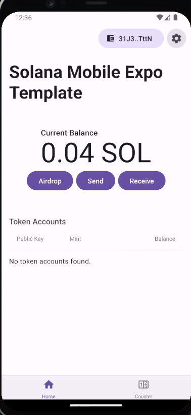
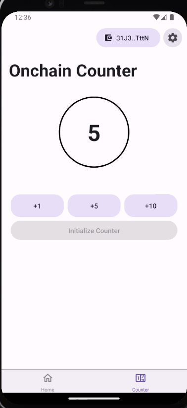
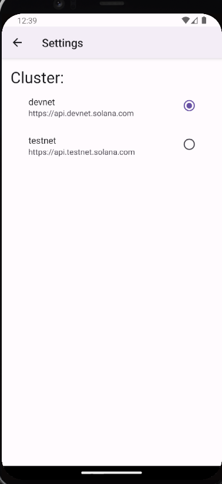

# Anchor Counter Dapp

一个参考应用，展示如何在 React Native 中使用和调用 Anchor 程序，使用 Mobile Wallet Adapter 作为签名器。

**此应用仅在 Android 上完全功能正常。**

## 技术栈

- [Mobile Wallet Adapter](https://github.com/solana-mobile/mobile-wallet-adapter/tree/main/js/packages/mobile-wallet-adapter-protocol) - 用于连接钱包和签名交易/消息
- [web3.js](https://solana-labs.github.io/solana-web3.js/) - 用于构建交易和 RPC `connection` 客户端

<table>
  <tr>
    <td align="center">
      
    </td>
    <td align="center">
      
    </td>
    <td align="center">
      
    </td>
  </tr>
</table>

<CTAButton label="在 GitHub 上查看" to="https://github.com/solana-mobile/solana-mobile-dapp-scaffold" />

## 先决条件

- 一个 [Expo](https://expo.dev/) 账户
- React Native 和 Android 环境 [设置](https://docs.solanamobile.com/getting-started/development-setup)
  - Android 设备/模拟器
  - 在设备/模拟器上安装兼容 MWA 的钱包应用

## 使用方法

### 构建并运行应用

按照 Expo 设置指南中的 **["运行应用"](https://docs.solanamobile.com/react-native/expo#running-the-app)** 部分，将模板作为自定义开发构建启动。

### 初始化

使用以下命令初始化示例应用：

```
npx expo start --dev-client
```

选择项目名称，然后进入目录。

## 故障排除

- `Metro 遇到错误：尝试解析模块 @solana-mobile/mobile-wallet-adapter-protocol...`

  - 这是使用 `npm install` 安装 Expo 模板时的持续性问题
  - 解决方法：清理项目依赖并使用 `yarn install` 重新安装

- `包 'solana-mobile-wallet-adapter-protocol' 似乎未链接。请确保：...`

  - 确保您**没有**使用 Expo Go 运行应用
  - 您需要使用 [Expo 自定义开发构建](https://docs.solanamobile.com/react-native/expo#custom-development-build)，而不是 Expo Go

- `无法连接到...`

  - 这是 Expo 错误，可能在特定 Wi-Fi 网络上尝试连接到开发服务器时发生
  - 修复方法：尝试使用 `--tunnel` 命令启动开发服务器 (`npx expo start --dev-client --tunnel`)

- `错误：不支持 crypto.getRandomValues()`
  - 这是在 React Native/Expo 环境中尝试使用 `@solana/web3.js` 中的某些函数时的 polyfill 问题
  - 修复方法：确保您的应用正确导入和使用 polyfill，如本[指南](http://docs.solanamobile.com/react-native/expo#step-3-update-appjs-with-polyfills)所示

<br>

- `错误：无法加载项目配置`
  - 同上，但针对 `yarn`。通过 yarn [卸载并重新安装](https://github.com/react-native-community/cli#updating-the-cli) CLI

<br>

- `看起来您的 iOS 环境未正确设置`：
  - 您可以在模板初始化期间忽略此提示，并正常构建 Android 应用。此模板仅兼容 Android

<br>

- `使用错误：看起来您正在尝试使用 https:... URL 添加包；我们现在要求明确指定包名`
  - 此错误发生在某些版本的 `yarn` 上，如果您尝试通过 GitHub 仓库 URL 而不是 npm 包初始化模板，则会发生此错误。为避免此问题，请使用指定的 `@solana-mobile/solana-mobile-dapp-scaffold` 包，或将 `yarn` 版本降级到经典版本 (1.22.x)

<br>

- `错误：在 "@solana-mobile/solana-mobile-dapp-scaffold" 模板中找不到 ".../@solana-mobile/solana-mobile-dapp-scaffold/template.config.js" 文件`
  - 这是某些版本 `yarn` (>= 3.5.0) 的[已知错误](https://github.com/react-native-community/cli/issues/1924)。通过使用 `--npm` 标志运行 cli 命令或降级 `yarn` 版本来修复

## 版本声明

本节课程代码复制自 [solana-mobile/tutorial-apps](https://github.com/solana-mobile/tutorial-apps/tree/4b694128776e89f59827bd8dd413c2c96c9ed671/AnchorCounterDapp)
